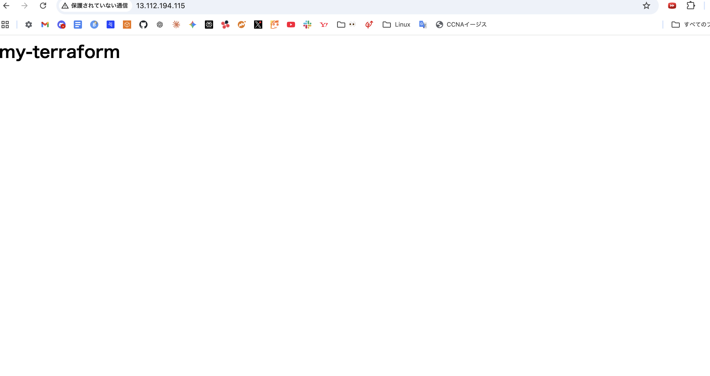
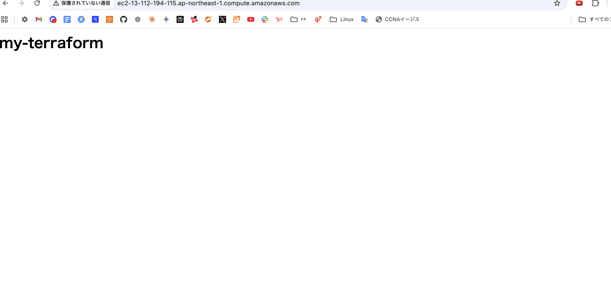
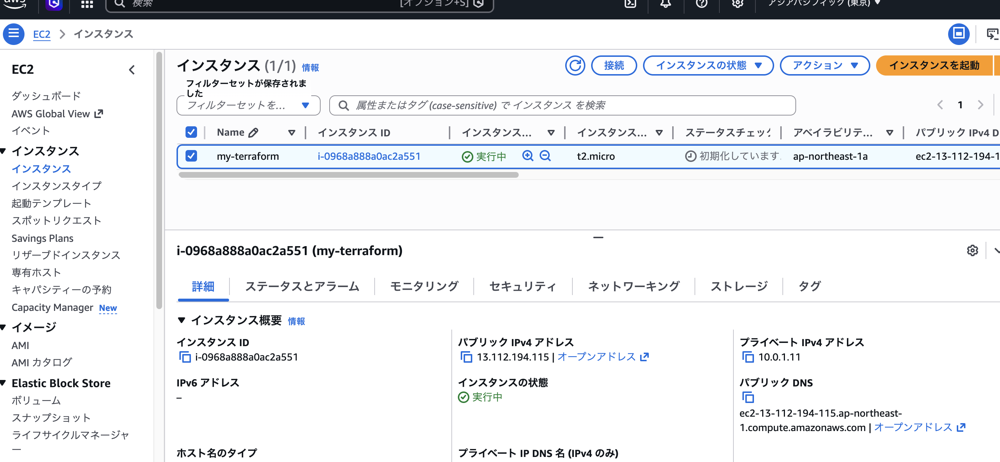
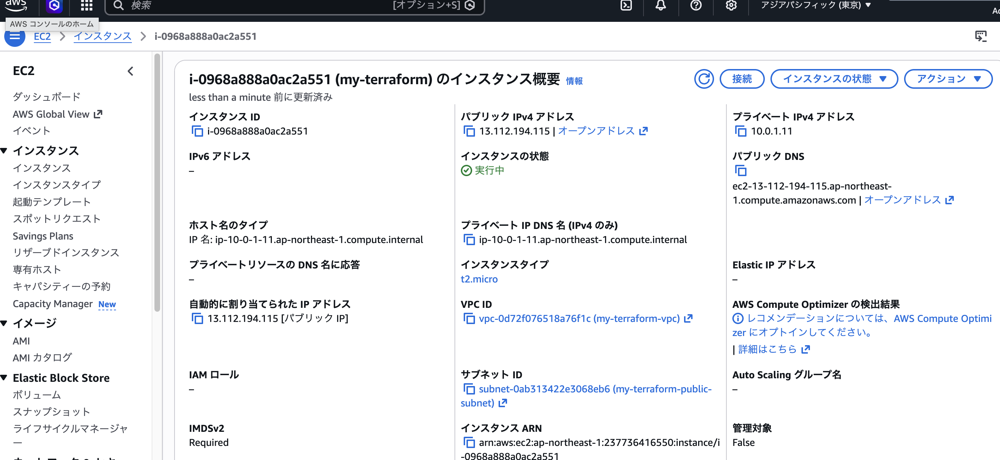
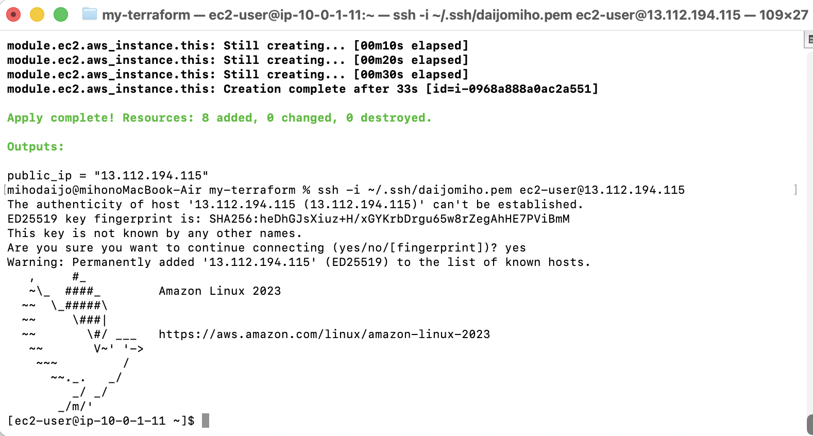
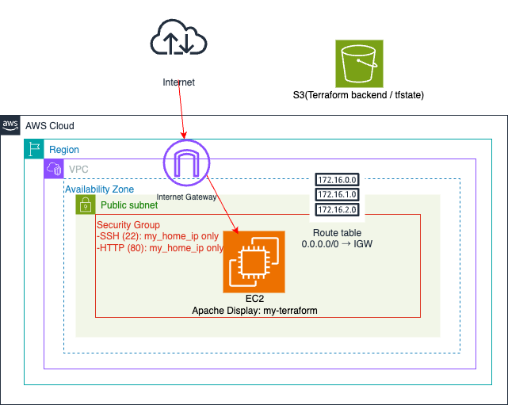

# my-terraform

Terraform を用いて AWS インフラ環境を構築した学習用プロジェクトです。

## 構成内容

- VPC
- Public Subnet
- Internet Gateway
- Route Table
- Security Group
- EC2

## 使用技術

## 動作確認

- Terraform apply により AWS 環境を構築
- EC2 の Public IP へブラウザアクセスし、Webページ表示を確認
- SSH 接続確認
- Terraform destroy によりリソース削除確認

### Webアクセス確認

Public IP / Public DNS にブラウザアクセスし、
Apache(httpd) による Webページ表示を確認。

### Public DNS 確認

### EC2 作成確認

Terraform apply により EC2 作成を確認。

### SSH 接続確認

SSH による EC2 ログイン確認。

## 構成図

## 振り返り・得られたこと・今後の課題

Terraform を用いた AWS インフラ構築を通して、
VPC / Subnet / Internet Gateway / Route Table / Security Group / EC2 の
役割や接続関係について理解を深めることができました。

また、Terraform apply / destroy による
リソース作成と削除、Webアクセス確認、SSH接続確認を実施し、
Terraform によるインフラ管理の流れを確認しました。

Terraform backend 用 S3 バケットについては事前に手動作成を行いましたが、
今後は backend 用 S3 バケット作成も Terraform 化し、
bootstrap 用 Terraform と本構成を分けた二段階 apply 構成にも取り組みたいと考えています。

さらに、RDS(MySQL) を利用したアプリケーション構成も再度構築・検証を行い、
AWS と Terraform の理解をさらに深めていきたいと考えています。
